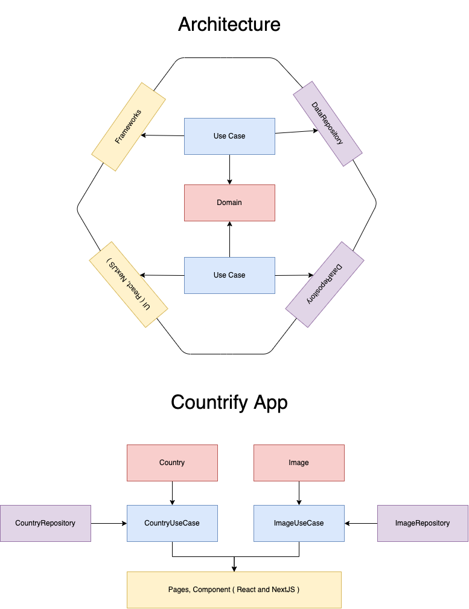

Demo: https://countrify.vercel.app/

## Architecture

<p align="center">
    
</p>

## Local Setup

First, add the UNSPLASH_TOKEN variables into a .env file:

```bash
UNSPLASH_TOKEN=your_token
```

Then, run the development server:

```bash
npm run dev
# or
yarn dev
```

Open [http://localhost:3000](http://localhost:3000) with your browser to see the result.

## Run the tests

To run the test for the components, data and pages:

```bash
npm run test
```
